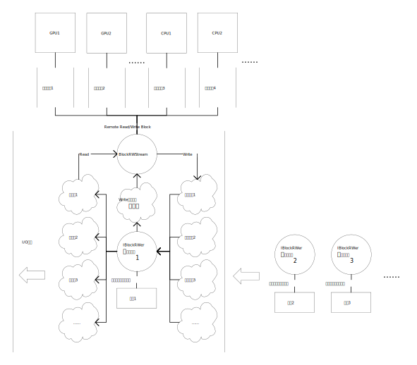

埃博拉酱的并行计算工具箱，提供一系列实用的并行计算辅助功能

本项目的发布版本号遵循[语义化版本](https://semver.org/lang/zh-CN/)规范。开发者认为这是一个优秀的规范，并向每一位开发者推荐遵守此规范。
# 目录
本包中所有函数均在ParallelComputing命名空间下，使用前需import。使用命名空间是一个好习惯，可以有效防止命名冲突，避免编码时不必要的代码提示干扰。
```MATLAB
import ParallelComputing.*
```
[@BlockRWStream](#BlockRWStream) 为无法一次性全部读入内存的大文件，提供单线程读写、多线程计算的解决方案

[@IBlockRWer](#IBlockRWer) 为BlockRWStream所调用的读写器必须实现的抽象接口类

[@RemoteFunctionHandle](#RemoteFunctionHandle) 远程调用句柄。无论在哪个线程上调用，都会在创建对象的线程上执行

[SetParpool](#SetParpool) 将当前并行池设定指定的工作进程数目
# @BlockRWStream
为无法一次性全部读入内存的大文件，提供单线程读写、多线程计算的解决方案

处理大量数据时，经常遇到单个数据文件过大，无法一次性全部读入内存再处理的问题。此时只能先读入一个小数据块，计算处理后，输出结果，释放内存，再读入下一个。在单线程环境下，这是唯一的解决方案。但在多线程环境下，我们往往发现，尽管中间计算过程受益于多线程得到了加速，但输入和输出的I/O过程，只能单线程执行：磁盘、网络等I/O设备并不会被多线程加速。即使在代码中指定为并行I/O，硬件上也不能真正做到并行，而仅仅是在多个线程之间不断切换实现的"伪并行"，更不用说这种切换还会产生额外的开销，总体性能还不如单线程。

因此我们认为，在多线程环境下的最优方案，是单线程读写、多线程计算。即设置一个服务线程，专门负责I/O等单线程操作，然后将数据分发到多个工作线程执行计算，计算结果再归并到服务线程执行写出操作。MATLAB恰好提供了一个这样的线程模型，即主线程-并行计算模型。MATLAB的界面和一般的代码、命令行任务都在主线程中执行，但可以在代码中引入并行命令，如 spmd parfor parfeval 等（依赖 Parallel Computing Toolbox），在并行线程上执行代码。

BlockRWStream在此基础上建立了一个框架，以支持在主线程上执行对文件的分块I/O操作，在并行线程上执行计算。其中复杂的线程同步、数据分发和收集问题，都被封装起来，对用户透明。用户只需要关心数据的具体读写操作和处理过程。

请注意，并行线程并非多多益善，而是存在一个最优数目，为数据计算时间与I/O时间之比，向上取整。例如，读入一个数据块需要1min，处理这些数据需要5min，写出计算结果又需要1min，那么最优的线程配置方案就是ceil(5/(1+1))=3个计算线程，加上1个I/O主线程，共4个线程。过多的计算线程只会长期处于等待主线程I/O的状态，并不能缩短总的工作时间，反而占用额外的内存。特别地，如果计算时间比I/O时间还要短，那么1个I/O线程+1个计算线程共2个线程的方案就已经达到最优。具体的方案因硬件和任务而异，需要用户手动设置，BlockRWStream只会按照当前设置安排并行。在不知道具体的计算时间与I/O时间之比时，可以通过试验测定。线程数达到最优的判定标准是，在保证I/O线程稳定处于满负荷工作状态条件下，并行线程数尽可能少。用户可以使用ParallelComputing.SetParpool轻松设置并行线程个数，更复杂的设置则需参考parpool文档。

下面给出一个示例。该示例执行的任务是，读入一批庞大的视频文件，将每个视频的所有帧叠加取平均，得到平均帧图，每个视频输出一张图。

第一步，实现ParallelComputing.IBlockRWer抽象接口类，定义视频读入过程。此代码在[IBlockRWer](#IBlockRWer)的文档中展示，此处不再赘述。

第二步，定义BatchVideoMean函数，利用BlockRWStream实现视频批量平均图操作：
```MATLAB
function BatchVideoMean(VideoPaths)
%BlockVideoReader是实现了ParallelComputing.IBlockRWer的具体类。将它的构造函数句柄交给BlockRWStream构造函数，得到的对象执行SpmdRun方法，对每个数据块返回其全帧总和和帧数。数据块可以在GPU上执行计算，返回2个元胞。计算过程将占用2倍于数据块大小的内存。
CollectData=ParallelComputing.BlockRWStream(VideoPaths,@BlockVideoReader).SpmdRun(@(Data){sum(Data,4),size(Data,4)},NArgOut=1,NumGpuArguments=1,RuntimeCost=2);
%返回的CollectData包含了所有文件所有数据块的全帧总和和帧数。
[Directories,Filenames]=fileparts(VideoPaths);
OutputPaths=fullfile(Directories,Filenames+".平均.png");
%将在每个视频文件的同目录下生成一个平均帧PNG图像。
for V=1:numel(CollectData)
	Data=vertcat(CollectData{V}{:});
	Data=vertcat(Data{:});
	%将每个文件的数据块归并，计算全帧平均，写出PNG图像。
	imwrite(uint8(sum(cat(4,Data{:,1}))/sum([Data{:,2}])),OutputPaths(V));
end
```
此示例中，数据块的计算操作实际上只有一个求和和求尺寸，非常快，一般不会比读入时间更长，所以只需1个计算线程+1个I/O线程就足够了。调用此函数BatchVideoMean之前可以使用ParallelComputing.SetParpool(1)以设置只使用1个计算线程。

BlockRWStream的所有方法均支持子类继承重写。您可以在理解其工作原理的基础上按需更改其行为。在ParallelComputing.BlockRWStream.NextObject文档中提供了一个示例，该示例重写NewObject函数，以实现每次读取新文件时输出进度信息。

本类的属性一般作调试信息用，监视进度和状态，不应手动修改。

多数情况下，您只需实现IBlockRWer、构造BlockRWStream对象、调用ParallelComputing.BlockRWStream.SpmdRun方法即可完成工作流。如果您需要更自定义地控制工作流，可以自行建立并行框架，然后调用BlockRWStream下的 Local/Remote Read/Write Block 方法，进行自定义的本地/远程读写操作。SpmdRun本质上也是通过调用这些方法实现的。[SpmdRun](#SpmdRun)方法的文档中展示了工作流的细节，建议参考。

此类对象的使用是一次性的。一旦所有文件读取完毕，对象就会报废，无法重复使用，必须新建。
## 只读属性
RWObjects，输入的文件列表，依次作为GetRWer的参数以获取读写器。

NumObjects，文件个数

GetRWer，获取读写器的函数句柄，通常是读写器的构造函数

ObjectsRead，已经读完的文件个数

PiecesRead，当前文件已经读完的数据片个数

BlockTable，维护每个数据块的信息表

ObjectTable，维护每个文件的信息表
## 保护方法
### NextObject
打开新的文件以供读取。此方法只有在BlockRWStream刚刚构建完毕，以及上一个文件读取完毕后才被内部调用。但需要检查是否所有文件已经读完。

此方法没有输入输出，仅设置类内部各属性的状态。此方法标志着上一个文件读入完毕、下一个文件开始读入，因此可以重写它以输出进度信息。如下示例：
```MATLAB
classdef ShowProgress<ParallelComputing.BlockRWStream
	methods(Access=protected)
		function NextObject(obj)
			%先调用基类，执行该方法必要的基本功能
			obj.NextObject@ParallelComputing.BlockRWStream;
			%然后输出进度
			Index=obj.ObjectsRead+1;
			fprintf('文件%u/%u：%s\n',Index,obj.NumObjects,obj.RWObjects(Index));
		end
	end
	methods
		function obj=ShowProgress(RWObjects,GetRWer)
			obj@ParallelComputing.BlockRWStream(RWObjects,GetRWer);
		end
	end
end
```
## 公开方法
### BlockRWStream（构造方法）
需要提供文件列表和获取读写器的函数句柄。

**语法**
```MATLAB
obj=ParallelComputing.BlockRWStream(RWObjects,GetRWer);
```
**输入参数**

RWObjects(:,1)，文件列表。本质上是要交给GetRWer的参数，因此该参数具体内容由GetRWer决定。每次打开新文件，会将RWObjects的一个元素交给GetRWer以获取读写器。可以用元胞包含复杂参数，或者继承此类以实现更复杂的构造。

GetRWer，用于获取读写器的函数句柄。该句柄必须只接受一个标量参数，输出一个ParallelComputing.IBlockRWer对象。
### CollectReturn
所有计算线程结束后，由主线程调用此方法，收集返回的计算结果。

**返回值**

CollectData，一个元胞列向量，每个元胞对应一个文件的计算结果。元胞内又是元胞列向量，每个元胞对应一个数据块的计算结果，即计算线程每次调用Local/Remote WriteBlock时提供的Data参数。如果使用SpmdRun，每个数据块的计算结果将是一个元胞行向量，对应计算函数的每个返回值。例如，如果返回m×1元胞列向量，说明输入的文件有m个；其中第a个元胞内是n×1元胞列向量，说明第a个文件被分成了n块读入；其中第b个元胞内是1×p元胞行向量，说明可能是用了SpmdRun且计算函数有p个返回值。

Metadata，每个文件的元数据，为每个读写器的Metadata属性值，排列在元胞列向量中。
### LocalReadBlock
在单线程环境下，读入一个数据块。

此方法只能在构造该对象的线程上调用，因此通常用于单线程环境，退化为读入-计算-写出的简单流程。

**语法**
```MATLAB
[Data,BlockIndex]=obj.LocalReadBlock(ReadSize)
```
**输入参数**

ReadSize，建议读入的字节数。因为读入以数据片为最小单位，实际读入的字节数是数据片字节数的整倍，读入数据片的个数为建议字节数/数据片字节数，向下取整。

**返回值**

Data，读写器返回的数据块。实际读入操作由读写器实现，因此实际数据块大小不一定符合要求。BlockRWStream只对读写器提出建议，不检查其返回值。此外，如果所有文件已读完，将返回missing。

BlockIndex，数据块的唯一标识符。执行完计算后应将结果同此标识符一并返还给BlockRWStream.LocalWriteBlock，这样才能实现正确的结果收集和写出。如果所有文件已读完，将返回missing，可用ismissing是否应该结束计算线程。
### LocalWriteBlock
在单线程环境下，写出一个数据块。

此方法只能在构造该对象的线程上调用，因此通常用于单线程环境，退化为读入-计算-写出的简单流程。

**语法**
```MATLAB
obj.LocalWriteBlock(Data,BlockIndex)
```
**输入参数**

Data，数据块处理后的计算结果。可以用元胞数组包含多个复杂的结果。此参数将被直接交给读写器的Write方法。

BlockIndex，数据块的唯一标识符，从LocalWriteBlock获取，以确保读入数据块和返回计算结果一一对应。
### RemoteReadAsync
在计算线程上，向I/O线程异步请求读入一个数据块。异步请求不会等待，而是先返回继续执行别的代码，等需要数据时再提取结果。

此方法可以在并行计算线程（parfor spmd parfeval 等）上调用，但会在I/O主线程上执行读入操作，然后将数据返回给计算线程。

**语法**
```MATLAB
IPollable=obj.RemoteReadBlock(ReadSize)
```
**示例**
```MATLAB
IPollable=obj.RemoteReadAsync(ReadSize);
DoOtherJob();
IPollable.poll(Inf);
```
**输入参数**

ReadSize，建议读入的字节数。因为读入以数据片为最小单位，实际读入的字节数是数据片字节数的整倍，读入数据片的个数为建议字节数/数据片字节数，向下取整。

**返回值**

IPollable(1,1)parallel.pool.PollableDataQueue，可等待的数据队列。需要数据时，调用其poll成员方法可以取得数据。poll将返回1×2元胞行向量，分别包含RemoteReadBlock的两个返回值。
### RemoteReadBlock
在计算线程上，向I/O线程请求读入一个数据块

此方法可以在并行计算线程（parfor spmd parfeval 等）上调用，但会在I/O主线程上执行读入操作，然后将数据返回给计算线程。

**语法**
```MATLAB
[Data,BlockIndex]=obj.RemoteReadBlock(ReadSize)
```
**输入参数**

ReadSize，建议读入的字节数。因为读入以数据片为最小单位，实际读入的字节数是数据片字节数的整倍，读入数据片的个数为建议字节数/数据片字节数，向下取整。

**返回值**

Data，读写器返回的数据块。实际读入操作由读写器实现，因此实际数据块大小不一定符合要求。BlockRWStream只对读写器提出建议，不检查其返回值。此外，如果所有文件已读完，将返回missing。

BlockIndex，数据块的唯一标识符。执行完计算后应将结果同此标识符一并返还给BlockRWStream.RemoteWriteBlock，这样才能实现正确的结果收集和写出。如果所有文件已读完，将返回missing，可用ismissing是否应该结束计算线程。
### RemoteWriteBlock
在计算线程上，向I/O线程请求写出一个数据块

此方法可以在并行计算线程（parfor spmd parfeval 等）上调用，但会在I/O主线程上执行写出操作。计算线程在发出请求后不会等待操作完成，而是继续向下运行。

**语法**
```MATLAB
obj.LocalWriteBlock(Data,BlockIndex)
```
**输入参数**

Data，数据块处理后的计算结果。可以用元胞数组包含多个复杂的结果。此参数将被直接交给读写器的Write方法。

BlockIndex，数据块的唯一标识符，从RemoteWriteBlock获取，以确保读入数据块和返回计算结果一一对应。
### SpmdRun
BlockRWStream的招牌方法，用几个简单的参数实现单线程I/O多线程计算框架

作为招牌，此方法展现了整个BlockRWStream类的设计思想：

1. 用户告诉BlockRWStream，要读入的文件列表，和获取读写器的函数句柄，然后BlockRWStream会据此构造读写器，并收集IBlockRWer.Metadata保存起来。
2. 启动并行计算线程。BlockRWStream负责在主线程和并行线程之间交流。SpmdRun会自动为每个线程分配硬件，为前几个线程分配GPU设备，后面的线程则只能分到CPU设备。
3. 在SpmdRun的调度下，并行线程根据自己分配到的设备内存（GPU内存或CPU内存），通过BlockRWStream依次向I/O线程请求相应大小的数据块（考虑到运行时额外内存消耗，数据块通常比内存小）。I/O线程收到BlockRWStream.RemoteReadBlock请求，根据读写器提供的IBlockRWer.PieceSize属性，计算出数据块包含多少个数据片，然后将请求通过IBlockRWer.Read方法转交给读写器，由读写器实际执行用户定义的读入操作，读入数据块，然后再由BlockRWStream跨越线程边界将数据块返回给计算线程。
4. 计算线程收到数据块后，SpmdRun会假定数据块是一个元胞数组，每个元胞内存放着一个要交给BlockProcess的参数。BlockProcess是用户定义的并行计算函数句柄。因此，用户定义的读写器Read方法，必须返回元胞数组才能适用于SpmdRun。
5. 计算线程计算过程中，I/O线程可以继续执行其它计算线程的请求。计算完毕后，通过BlockRWStream.RemoteWriteBlock，将计算结果发给I/O线程，I/O线程同样转交给读写器。读写器按照用户定义的代码，将计算结果分流，一部分写出到文件，另一部分返还给BlockRWStream，返还的这部分会存放在BlockRWStream.BlockTable.ReturnData中。
6. BlockRWStream会根据读写器提供的IBlockRWer.NumPieces属性判断文件是否已经读完。一旦读完，将为下一个文件新建读写器，以便继续读入数据块。此时上一个文件可能还有正在计算中的数据块，所以读写器会被暂时保留，直到该文件的最后一个数据块计算完毕，保存好计算结果后，读写器才被销毁。
7. 所有文件读写完成后，所有读写器被销毁，并行线程结束。调用BlockRWStream.CollectReturn方法，会将之前收集在BlockRWStream.BlockTable.ReturnData中的数据按文件分类返回。同时也会返回从每个读写器收集到的IBlockRWer.Metadata。
8. SpmdRun返回后，BlockRWStream对象即处于报废状态，只能收集返回值，无法重新运行，只能销毁重建。

**语法**
```MATLAB
[CollectData,Metadata]=obj.SpmdRun(BlockProcess,ConstantArgument1,ConstantArgument2,…,Name1=Value1,Name2=Value2,…);
```
**输入参数**

BlockProcess，必需，用户提供的处理单个数据块的函数句柄。每次读入数据块后，SpmdRun会在并行计算线程上调用该函数。其输入参数可分为3类：
1. 适用于GPU的数据块参数。如果希望使用GPU计算，将可以转换为gpuArray的参数放在BlockProcess参数列表最靠前的位置。SpmdRun会在将参数交给BlockProcess之前将这些参数转换为gpuArray。指定NumGpuArguments参数，这样SpmdRun才知道要将前几个参数转换为gpuArray。
2. 不适用于GPU的数据块参数。有些参数不能转换为gpuArray，将它们放在BlockProcess参数列表中间的位置。
3. 常量参数。这些参数与读入的数据块和文件无关，在整个工作流程中保持恒定。这部分参数放在BlockProcess参数列表的最后。然后将这些常量值作为重复参数交给SpmdRun的ConstantArgument参数，SpmdRun会保存这些常量值，每次调用BlockProcess时将它们传递。

BlockProcess会在多个独立的计算线程上并行运行，因此请勿在函数中使用共享静态资源，如persistent变量等。共享静态资源请通过IBlockRWer的Read方法（对于文件内相同、文件间不同的资源），或SpmdRun的ConstantArgument参数（文件间也相同）传入。

ConstantArgument，重复参数，提供给BlockProcess的常量参数。这些参数与当前读入的是哪个文件、第几个数据块均无关，在整个计算过程中保持为常量。SpmdRun会将这些参数保存起来，接在数据块参数之后交给BlockProcess，且值恒定不变。

Name=Value，可以指定以下名称值参数：
- NArgOut=0，BlockProcess的返回值个数。这些返回值将以元胞行向量形式交给读写器的Write方法。如果读写器未重写Write方法，将原封不动被收集到CollectData中。
- RuntimeCost=2，运行时实际将要占用的内存是数据块的多少倍。这是一个需要评估调校的性能参数。SpmdRun会根据当前内存自动设置要读取的数据块大小，但无法估计计算线程将额外占用多少内存，需要用户告知。此值过大将导致内存不足，过小则会导致内存得不到充分利用，数据块划分过多，尤其影响GPU的性能。因为GPU的并行计算特点，其计算时间与数据块大小无关，只与计算步骤个数有关。因此数据块划分越多，GPU计算越慢。应当在GPU内存充足的前提下尽可能读入更大的数据块。
- NumGpuArguments=0，前几个数据块参数要送入GPU运行。SpmdRun会自动检测当前GPU设备，尽可能将数据块送到GPU运行。但有些数据无法送入GPU，需要用户判断。请将可以送入GPU的数据块参数放在最前面，然后指定GPU参数个数。默认0，表示不使用GPU，只用CPU运算。

**返回值**

此函数最后会调用CollectReturn成员方法，直接返回该方法返回的CollectData和Metadata。

CollectData，一个元胞列向量，每个元胞对应一个文件的计算结果。元胞内又是元胞列向量，每个元胞对应一个数据块的计算结果，即计算线程每次调用Local/Remote WriteBlock时提供的Data参数。每个数据块的计算结果将是一个元胞行向量，对应BlockProcess的每个返回值。例如，如果返回m×1元胞列向量，说明输入的文件有m个；其中第a个元胞内是n×1元胞列向量，说明第a个文件被分成了n块读入；其中第b个元胞内是1×p元胞行向量，说明BlockProcess有p个返回值。

Metadata，每个文件的元数据，为每个读写器的Metadata属性值，排列在元胞列向量中。
# @IBlockRWer
为BlockRWStream所调用的读写器必须实现的抽象接口类

抽象接口类不能直接实例化。您必须针对您要读写的文件实现自己的专用读写器类，继承此类并实现抽象属性和方法。一般来说，一个实例对象只用于读取一个指定的文件；也可以同时写出到另一个指定的文件。

BlockRWStream会控制此对象的生命周期为，从读取第一个数据块开始，到写出最后一个数据块结束（delete）。由于上一个文件完成写出之前，下一个文件可能已经开始读入，同一时刻可能会有多个对象同时存在。

作为示例，此处提供一个简单的视频读取器实现：
```MATLAB
classdef BlockVideoReader<ParallelComputing.IBlockRWer&VideoReader
	%此类将一个视频的每一帧作为一个数据片，对大视频文件进行分块读入。
	properties(SetAccess=immutable)
		PieceSize
		NumPieces
		Metadata
	end
	methods
		function obj = BlockVideoReader(VideoPath)
			obj@VideoReader(VideoPath);
			Sample=obj.readFrame;

			%设置一个数据片的尺寸为视频一帧的字节数
			obj.PieceSize=numel(typecast(Sample(:),'uint8'));

			%数据片的个数就是视频帧数
			obj.NumPieces=obj.NumFrames;

			%没有元数据就可以不设置Metadata
		end
		function Data = Read(obj,Start,End)
			%套一层元胞以支持BlockRWStream.SpmdRun
			Data={obj.read(Start:End)};
		end
	end
end
```
数据片指的是一次性必须读入的最小数据单元，小于这个单元的数据将无法处理。每次读入的数据块通常由多个相邻的数据片顺序串联而成，具体串联多少个取决于当前内存状况。例如，对于视频，一个数据片通常就是一帧。
## 只读抽象属性
PieceSize，必须实现的抽象属性，指示每个数据片的字节数。BlockRWStream将根据此属性决定一次要读取多少片。

NumPieces，必须实现的抽象属性，指示文件中有多少个数据片。BlockRWStream将根据此属性判断是否已读取完该文件。

Metadata，必须实现的抽象属性，专属于该文件的元数据信息。BlockRWStream将在打开每个文件时收集该元数据。如果文件没有元数据，可以不设置此属性的值。
## 抽象方法
### Read
必须实现的抽象成员方法，用于读取指定的数据块。

BlockRWStream收到 Remote/Local ReadBlock 调用后，将根据PieceSize计算出要读取的数据片起始和终止点，然后调用此方法读取数据块。

BlockRWStream保证数据是从头到尾顺序读取的。每次读取数据块的大小不一定相同，但不会有重复或遗漏。您可以根据此顺序性优化读入器的性能。

**语法**
```MATLAB
Data=obj.Read(Start,End);
```
**输入参数**

Start，起始数据片

End，终止数据片

**返回值**

Data，从Start到End（含两端）的数据块，将返回给 Remote/Local ReadBlock 的调用方。如果您使用BlockRWStream的SpmdRun方法，此方法必须返回元胞数组，每个元胞存放一个要交给SpmdRun的BlockProcess的参数。如果您指定了SpmdRun的NumGpuArguments参数值为n，则返回元胞数组的前n个元胞内必须是可以转换为gpuArray的数据类型。此外，您还可以在此处返回一些"在同一个文件的不同数据块之间共享，但在不同的文件之间不能共享"的参数。
## 可选重写
### Write
可选重写的成员方法，用于写出数据块

BlockRWStream收到 Remote/Local WriteBlock 调用后，将会把调用方提供的数据块交给此方法处理，并提供读取该数据块时的数据片位置信息。

该方法默认不做任何事直接返回原数据块。返回的数据块将被BlockRWStream收集起来，在CollectReturn时返回。如果您需要将处理后的数据块写出到文件，或者有其它自定义操作，可以重写此方法。

BlockRWStream不保证数据是从头到尾顺序写出：先读入的数据块有可能反而较晚被写出。请保证您的写出器支持随机写出。

**语法**
```MATLAB
Data=obj.Write(Data,Start,End);
```
**输入参数**

Data，要写出的数据块，由Remote/LocalWriteBlock调用方提供。如果您使用BlockRWStream的SpmdRun方法，此参数必定是元胞行向量，每个元胞内存放一个BlockProcess的返回值。即使BlockProcess只有1个返回值，SpmdRun也会将它包装在元胞中。

Start End，读取该数据块时的起始和终止数据片位置。因为计算结果的写出不像读入时那样顺序进行，您必须根据Start和End计算出要将结果写出到输出文件的哪个位置。

**返回值**

Data，不写出，而是交由BlockRWStream负责收集的数据部分。很多时候您可能只希望将一部分计算结果输出到文件，那么剩余仍留在内存中的部分就返回给BlockRWProcess收集起来，日后调用BlockRWProcess.CollectReturn即可返回这部分数据。
# @RemoteFunctionHandle
远程调用句柄。无论在哪个线程上调用，都会在创建对象的线程上执行

在并行计算中，常常会遇到某些资源只接受单线程访问的情况。其它线程不能直接操作该资源，只能向资源线程发出请求，资源线程负责调度执行。RemoteFunctionHandle可以将一个再资源线程上执行的函数句柄包装成一个对象发送到计算线程。计算线程Invoke此对象，就可以令资源线程执行该函数，实现远程调用。
```MATLAB
%本例中，主线程持有一个无法一次性载入内存的100㎇大文件。文件只能单线程访问，分多个1㎇的数据块读入内存然后由并行线程执行计算，因此主线程需要不断按照并行线程的要求读取文件。
Fid=fopen('100㎇BigFile.bin');
BlockSize=bitshift(1,30);
ReadFun=ParallelComputing.RemoteFunctionHandle(@()fread(Fid,BlockSize));
%Fid是主线程独占的资源，其它线程无法通过该Fid访问文件，因此该函数句柄只能在主线程执行。但是通过RemoteFunctionHandle包装后，可以被并行线程调用。
parfor B=1:100
	Data=ReadFun.Invoke;
	%并行线程调用ReadFun，向主线程请求读取文件，然后返回给并行线程。如果多线程同时调用ReadFun，主线程会自动对请求进行排序。这个顺序是运行时动态确定的，请勿对顺序做出任何假定。
end
```
RemoteFunctionHandle只会在创建它的线程上实际执行函数，无法转移到其它线程执行。此外，请避免嵌套使用RemoteFunctionHandle，否则可能陷入线程互相等待的死锁。并行线程运行期间，请确保主线程仍保有RemoteFunctionHandle的原本，特别是在函数内调用parfeval，但不在本函数内等待其完成的时候。例如，以下操作将会失败：
```MATLAB
RunTask(fopen('100㎇BigFile.bin'));

function RunTask(Fid)
BlockSize=bitshift(1,30);
ReadFun=ParallelComputing.RemoteFunctionHandle(@()fread(Fid,BlockSize));
parfeval(@ProcessData,1,ReadFun);
end
%RunTask不等待parfeval执行完毕就返回了，主线程上的ReadFun是RunTask的局部变量，RunTask返回后ReadFun就被销毁，主线程将不再能接收到请求。

function ProcessData(ReadFun)
pause(10);
Data=ReadFun.Invoke; %此调用永远不会返回，因为主线程上的ReadFun被销毁了。
end
```
对于上例，可以将ReadFun返回以避免它被销毁：
```MATLAB
ReadFun=RunTask(fopen('100㎇BigFile.bin'));

function ReadFun=RunTask(Fid)
BlockSize=bitshift(1,30);
ReadFun=ParallelComputing.RemoteFunctionHandle(@()fread(Fid,BlockSize));
parfeval(@ProcessData,1,ReadFun);
end
%ReadFun作为返回值而不被销毁，主线程继续持有。

function ProcessData(ReadFun)
pause(10);
Data=ReadFun.Invoke; %此调用可以正常返回
end
```
此外，还支持异步调用InvokeAsync方法，其原理类似于parfeval，详见该方法的文档。
## 构造函数
输入参数：FunctionHandle function_handle，要执行的函数句柄。该函数句柄将使用创建线程的资源执行。
## 成员方法
### Invoke
向创建线程请求执行函数，并等待返回值。如果没有返回值，该调用将不会等待执行完成。

函数的输入输出与原函数句柄完全一致。
### InvokeAsync

异步调用请求。请求不会等待执行完成，而是立刻返回一个parallel.pool.PollableDataQueue，可以等后续实际需要改返回值时再等待。

此方法类似于parfeval，可以先请求目标函数在创建线程上开始执行，但并不立即挂起请求线程等待执行完毕，而是允许请求线程继续执行其它任务。等到必须要等待时再行等待。

**语法**
```MATLAB
%若目标函数没有输入也没有输出：
Poller=obj.InvokeAsync;

%若目标函数有输出但没有输入：
Poller=obj.InvokeAsync(NArgOut);

%若目标函数有输入但没有输出：
Poller=obj.InvokeAsync(0,Arg1,Arg2,…);

%若目标函数既有输入又有输出：
Poller=obj.InvokeAsync(NArgOut,Arg1,Arg2,…);
```
**参数说明**

NArgOut，函数返回值的个数

Arg1,Arg2,…，输入给函数的参数

Poller(1,1)parallel.pool.PollableDataQueue，可等待的数据队列。使用此对象的poll方法可以等待目标函数返回。所有返回值都将排列在元胞行向量中返回。

**示例**
```MATLAB
Fid=fopen('100㎇BigFile.bin');
BlockSize=bitshift(1,30);
ReadFun=ParallelComputing.RemoteFunctionHandle(@()fread(Fid,BlockSize));
parfor B=1:100
	Poller=ReadFun.InvokeAsync(1); %此请求会立刻返回，而不等待主线程上数据块读取完成。
	%此时可以执行一些准备工作，与主线程上的数据读取并行执行，直到这样一个阶段，即不取得数据块就无法继续工作时：
	[Data,Success]=Poller.poll(100);
	%如果数据读取完毕，将立刻返回；若未读取完毕，则等待最多100秒，直到读取完毕再返回。这个时间默认为0，最长Inf，详见parallel.pool.PollableDataQueue.poll文档
	if Success
		%Success标志指示是否在限定时间内返回了数据。若成功，则可以处理数据
	else
		error('未在限定时间内返回数据');
	end
end
```
# SetParpool
将当前并行池设定指定的工作进程数目

MATLAB内置的parpool无法覆盖已有并行池，也不检查当前并行池尺寸是否恰好和设置一致，十分蹩脚。本函数一键解决问题，只需输入你想要的并行池尺寸，就能将当前并行池要么恰好尺寸一致而保留，要么尺寸不一致而关闭重启

输入参数：NumWorkers(1,1)，理想的并行池尺寸

返回值：Pool(1,1)parallel.ProcessPool，生成或当前的并行池，其NumWorkers属性与输入值一致